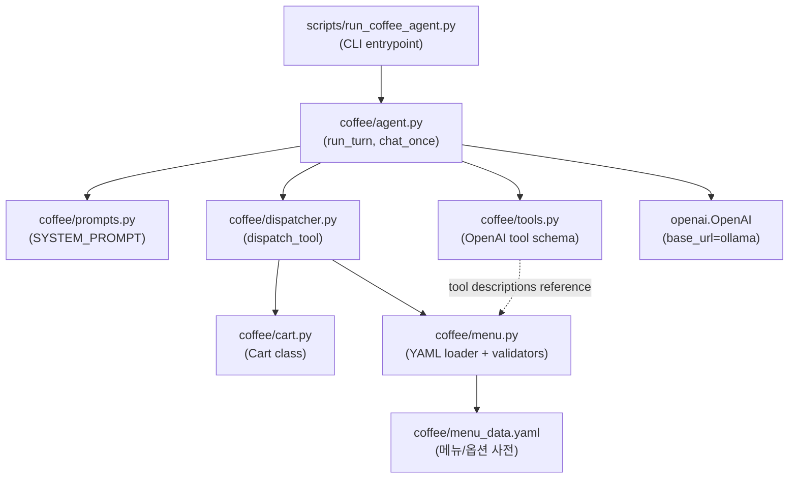

# Design: 로컬 커피 주문 에이전트 (Gemma 4 E2B)

**Status**: 🔄 Awaiting Phase 1 entry
**Companion plan**: `(historical, removed from repo)`
**Last Updated**: 2026-05-21

---

## 0. Plan 불일치 해소

Plan 문서에서 도구 수가 "7 tools"라고 명시했지만 괄호 안 나열은 8개였음:
> ~~7 tools (add_menu / remove_menu / change_quantity / replace_menu / change_option / check_cart / inquire_menu_info / done)~~

**결정 — 7 tools 유지, `change_quantity` 드롭**

근거:
- E2B 라우팅 정확도는 도구 수가 적을수록 안정. 8 → 7로 줄여서 마진 확보.
- "아메리카노를 두 잔으로 바꿔" (set semantics)는 add_menu가 이미 quantity 인자를 가지므로 처리 가능 — 기존 항목이 있으면 dispatcher가 set/increment를 결정.
- "한 잔만 빼주세요" (delta semantics)는 remove_menu(quantity=1)로 처리.
- 분리하면 set vs delta 의도 혼동 가능성 증가.

**최종 7 tools**: `add_menu` / `remove_menu` / `replace_menu` / `change_option` / `check_cart` / `inquire_menu_info` / `done`

---

## 1. 모듈 아키텍처



**의존 방향**: 단방향, cyclical import 없음. `cart` ↔ `menu`도 분리(cart은 메뉴 검증을 dispatcher 레벨에서 받음).

**파일별 단일 책임**:
| 파일 | 책임 |
|------|------|
| `agent.py` | OpenAI 클라이언트 호출 + tool round-trip 루프. 비즈니스 로직 없음 |
| `dispatcher.py` | tool_name → cart 메서드 라우팅. 도메인 검증 (메뉴 유효성, 옵션 유효성) |
| `cart.py` | 순수 카트 상태 관리. 도메인 검증 없음 (검증은 dispatcher에서) |
| `menu.py` | YAML 로드 + 사전 lookup helper |
| `tools.py` | OpenAI Function Call schema 정의 (정적 상수) |
| `prompts.py` | 시스템 프롬프트 + few-shot 예시 (정적 상수) |
| `menu_data.yaml` | 메뉴/옵션 사전 (비코드 데이터) |

---

## 2. 데이터 흐름

```
사용자 발화 ("아이스 아메리카노 한 잔, 디카페인으로")
   │
   ▼
agent.run_turn(messages, cart)
   │
   ├─[1] openai.chat.completions.create(model=gemma4:e2b, tools=...)
   │       ↓
   │   ChatCompletionMessage(tool_calls=[{name:"add_menu", args:{...}}])
   │
   ├─[2] for tool_call in message.tool_calls:
   │       dispatcher.dispatch_tool("add_menu", args, cart)
   │           ├─ menu.is_valid_menu("아이스아메리카노") → True
   │           ├─ menu.is_valid_options(["디카페인"]) → True
   │           ├─ cart.add(...) → {"status": "ADDED", "menu": ..., "quantity": 1}
   │           └─ return result
   │       messages.append({role:"tool", tool_call_id:..., content:json(result)})
   │
   ├─[3] openai.chat.completions.create(messages=[..., tool result])
   │       ↓
   │   ChatCompletionMessage(content="아이스 아메리카노 디카페인으로 한 잔 담았어요...")
   │
   └─[4] return final_response_text
```

**Round-trip 제한**: max 5회. 5회 안에 finish_reason=stop이 나와야 함 (안 나오면 break + 안내 응답).

---

## 3. 핵심 타입 / 인터페이스

### 3.1 Cart (coffee/cart.py)
```python
from dataclasses import dataclass, field
from typing import List

@dataclass
class CartItem:
    menu: str
    quantity: int
    options: List[str] = field(default_factory=list)

    def matches(self, menu: str, options: List[str]) -> bool:
        return self.menu == menu and sorted(self.options) == sorted(options)

class Cart:
    def __init__(self) -> None:
        self._items: List[CartItem] = []

    def add(self, menu: str, quantity: int, options: List[str]) -> dict: ...
    def remove(self, menu: str, quantity: int) -> dict: ...  # quantity=-1 또는 menu="ALL"
    def replace(self, from_menu: str, to_menu: str, to_options: List[str]) -> dict: ...
    def change_option(self, menu: str, new_options: List[str]) -> dict: ...
    def snapshot(self) -> List[dict]: ...   # 외부 노출용 read-only copy
    def is_empty(self) -> bool: ...
    def clear(self) -> None: ...
```

### 3.2 ToolResult (dispatcher 반환 schema)
모든 도구 결과는 다음 schema를 따른다:
```json
{
  "status": "ADDED" | "INCREMENTED" | "REMOVED" | "REPLACED" | "OPTION_CHANGED" 
            | "CART_VIEW" | "ORDER_COMPLETED" | "INVALID_MENU" | "INVALID_OPTION"
            | "MENU_NOT_IN_CART" | "EMPTY_CART" | "MENU_INQUIRY",
  "menu": "메뉴 이름" | null,
  "quantity": number | null,
  "options": ["옵션", ...] | null,
  "cart": [{menu, quantity, options}, ...] | null,
  "error_detail": "..." | null
}
```
LLM에게 전달될 때는 `json.dumps(result, ensure_ascii=False)` 형식. 모델은 이 정보를 읽고 자연어 응답 생성.

### 3.3 MessageHistory (agent.py)
OpenAI 표준 메시지 schema를 그대로 사용:
```python
Message = dict  # one of:
# {"role": "system", "content": str}
# {"role": "user", "content": str}
# {"role": "assistant", "content": str, "tool_calls": [...]?}
# {"role": "tool", "tool_call_id": str, "content": str}
```
별도 dataclass 없음 — openai SDK가 dict를 그대로 받음.

### 3.4 AgentConfig (agent.py)
```python
@dataclass
class AgentConfig:
    model: str = "gemma4:e2b"
    base_url: str = "http://localhost:11434/v1"
    api_key: str = "ollama"   # placeholder
    temperature: float = 0.0
    seed: int = 4242
    max_round_trips: int = 5
```
환경변수 override 가능: `OLLAMA_MODEL`, `OLLAMA_BASE_URL`. `.env` 와 호환.

---

## 4. menu_data.yaml — Ediya 메뉴 채택

**도메인 모델 변경 (venti → Ediya, 2026-05-21 결정)**:

| 항목 | venti (이전) | **Ediya (채택)** |
|------|-------------|-----------------|
| 사이즈 | 벤티(Small) / 더벤티(Large) / 하프벤티 | **라지(L, 18oz) / 엑스트라(EX)** |
| 사이즈 essential? | True | **False** — 미명시 시 라지 기본 |
| 디카페인 | 옵션 (`원두` 카테고리) | **별도 카테고리** (디카페인 콜드브루 등 별도 메뉴) |
| 원두 카테고리 | True (마일드/다크/디카페인 등) | **드롭** — Ediya는 원두 선택 옵션 없음 |
| 메뉴 수 | 200+ (페이크 디저트 포함) | **52종 (실제 메뉴)** |
| 카테고리 | 1개 통합 | **10개** (coffee/cold_brew/decaf/beverage/tea/bubble_tea/flatccino/ade/bakery/ice_flakes) |

전체 YAML은 `app/menu_data.yaml`에 작성됨 (52종 + 옵션 카테고리 6개).

**스키마 요약**:
```yaml
menus:
  - kr: "아이스아메리카노"
    en: "Iced Americano"
    category: "coffee"
    base_price_l: 4200

option_categories:
  - kr: "사이즈"
    is_essential: false   # 기본 L
    options:
      - {kr: "라지", en: "Large", price_delta: 0}
      - {kr: "엑스트라", en: "Extra", price_delta: 1000}
  - kr: "샷추가"
    applicable_categories: ["coffee", "cold_brew", "decaf"]
    ...
  # 시럽추가 / 휘핑선택 / 당도선택 / 얼음선택
```

**카테고리별 메뉴 수**:
- COFFEE: 16 (아메리카노/카페라떼/연유라떼/헤이즐넛라떼/카페모카/카라멜마끼아또/바닐라라떼/화이트초콜릿모카 × Hot/Iced)
- COLD BREW: 4 (콜드브루아메리카노/콜드브루라떼/연유콜드브루/흑당콜드브루)
- DECAF: 4 (디카페인 콜드브루 4종)
- BEVERAGE: 10 (달고나밀크/흑당밀크/모카음료/녹차라떼/곡물음료/순우유/레몬아이스티)
- BLENDING TEA: 6 (복숭아루이보스/후르츠허브티/민트티 × Hot/Iced)
- BUBBLE TEA: 2 (흑당버블티/우롱버블티)
- FLATCCINO: 2 (모카/요거트)
- ADE: 2 (모구모구 리치/피치)
- BAKERY: 3 (와플/프레첼/베이글)
- ICE FLAKES: 6 (단팥/망고/듀오초콜릿 × 컵/플레이트) — 시즌

**검증 규칙**:
- 메뉴 이름은 `kr` 필드로 정확 매칭 (예: "아이스아메리카노" — 공백 없음)
- 옵션은 `applicable_categories`로 적용 가능 카테고리 제한 (예: 샷추가는 coffee/cold_brew/decaf만)
- `is_essential=true`인 카테고리는 누락 시 status=`REQUIRED_OPTION_MISSING` 반환 — **v1에서는 essential 카테고리 없음** (사이즈는 기본 L로 대체)
- 디카페인 요청은 분기:
  - 콜드브루 계열 → 별도 DECAF 메뉴로 매핑 (예: "디카페인 아메리카노" → "디카페인콜드브루아메리카노")
  - 일반 커피 + 디카페인 → 시스템 프롬프트에서 안내 ("일반 커피는 디카페인 옵션이 없고 디카페인 콜드브루로 드릴 수 있어요")

---

## 5. 시스템 프롬프트 v1 (Ediya 도메인)

```
너는 이디야커피 매장의 친절한 AI 점원이야. 고객의 주문을 받고 카트에 담거나, 옵션을 변경하거나, 주문 내역을 안내해.

[필수 규칙]
1. 주문/변경/제거/조회는 반드시 제공된 도구(tool)를 호출해서 처리해. 도구 호출 없이 "담았어요" 같은 말을 만들어내지 마.

2. 아이스/핫은 메뉴 이름의 일부야. 메뉴를 부를 때 온도가 빠지면 사용자에게 먼저 물어봐.
   - "따뜻한 아메리카노" → menu="핫아메리카노"
   - "아이스 라떼" → menu="아이스카페라떼"
   - "아메리카노 주세요" (온도 미정) → 도구 호출 없이 "Hot이요, Ice요?" 물어봐.

3. 사이즈는 라지(L, 기본)와 엑스트라(EX) 두 가지야. 사용자가 명시 안 하면 라지로 진행 — 다시 물어보지 마.
   - "엑스트라로 주세요" → options=["엑스트라"]
   - 사이즈 미명시 → options=[] (라지 기본)

4. 디카페인은 이디야에서는 별도 메뉴로 운영돼. 디카페인 옵션을 따로 받지 마.
   - "디카페인 아메리카노" → menu="디카페인콜드브루아메리카노" (콜드브루로 안내)
   - "디카페인 라떼" → menu="디카페인콜드브루라떼"
   - 일반 핫커피에 디카페인 요청 → "이디야에서 디카페인은 콜드브루로만 가능해요. 디카페인 콜드브루로 드릴까요?" 안내

5. 매장에 없는 메뉴(예: 냉면, 스타벅스 메뉴)는 정중히 거절하고 비슷한 이디야 메뉴를 제안해.

6. 모호한 발화("커피 한 잔 주세요")는 추측하지 말고 어떤 커피인지 되물어봐.

[도구 선택 가이드]
- "한 잔 추가" → add_menu
- "그거 빼주세요" → remove_menu
- "A 말고 B로 바꿔" → replace_menu (메뉴 교체)
- "샷 추가" / "엑스트라 사이즈로" / "시럽 추가" → change_option (메뉴는 그대로, 옵션만 교체)
- "지금 뭐 시켰지" → check_cart
- "얼마예요" / "추천해주세요" → inquire_menu_info
- "주문 끝낼게요" / "결제할게요" → done

[응답 톤]
- "~해요" 어미. 정중하지만 간결.
- 따옴표(', "), 함수 이름, JSON, 코드블록은 응답에 절대 노출 X.
- 도구 결과(JSON)를 그대로 읽지 말고 자연스러운 문장으로 풀어서 전달.

[Few-shot 예시]

예시 1 — 온도 누락:
user: 아메리카노 한 잔 주세요.
assistant (도구 호출 없이): Hot이요, Ice요? 어떤 걸로 드릴까요?

예시 2 — replace vs change_option 구분:
user: 아메리카노 말고 카페라떼로 바꿔주세요.
→ replace_menu(from_menu="아이스아메리카노", to_menu="아이스카페라떼", to_options=[]) 호출

user: 엑스트라 사이즈로 변경해주세요.
→ change_option(menu="아이스아메리카노", new_options=["엑스트라"]) 호출

예시 3 — 디카페인 처리:
user: 디카페인 아메리카노 주세요.
→ add_menu(menu="디카페인콜드브루아메리카노", quantity=1, options=[]) 호출
assistant: 디카페인은 콜드브루로 드려요. 디카페인 콜드브루 아메리카노 한 잔 담았어요.

예시 4 — 모호 발화:
user: 커피 한 잔 주세요.
assistant (도구 호출 없이): 어떤 커피로 하시겠어요? 아메리카노, 카페라떼, 카페모카, 콜드브루, 헤이즐넛라떼 등이 있어요.
```

**튜닝 메모**:
- 길이 ~750 토큰 (Ediya 도메인 규칙 추가로 +150). 1000 이하 유지.
- few-shot 4개: 온도 누락 / replace vs change_option / 디카페인 처리 / 모호 발화.
- 디카페인 분기는 Ediya의 가장 특이한 규칙이므로 few-shot에 박제.

---

## 6. 7 Tools 최종 schema

E2B 라우팅 정확도 위해 description은 **의도 분리 + 호출 예시** 패턴 적용.

```python
# coffee/tools.py
TOOLS = [
    {
        "type": "function",
        "function": {
            "name": "add_menu",
            "description": (
                "장바구니에 새 메뉴를 추가하거나 기존 메뉴 수량을 늘려요. "
                "사용자가 처음 주문하거나 같은 메뉴를 더 추가할 때 호출. "
                "예: '아이스 아메리카노 한 잔 주세요', '바닐라 라떼 두 잔 더 주세요'. "
                "이미 같은 메뉴+옵션이 카트에 있으면 dispatcher가 자동으로 수량 증가 처리."
            ),
            "parameters": {
                "type": "object",
                "properties": {
                    "menu": {"type": "string", "description": "메뉴 이름 (아이스/핫 포함)"},
                    "quantity": {"type": "integer", "minimum": 1, "description": "수량. 명시 없으면 1"},
                    "options": {
                        "type": "array", "items": {"type": "string"},
                        "description": "옵션 목록 (사이즈/원두/시럽 등). 옵션 없으면 빈 배열 []"
                    }
                },
                "required": ["menu", "quantity", "options"]
            }
        }
    },
    {
        "type": "function",
        "function": {
            "name": "remove_menu",
            "description": (
                "장바구니에서 메뉴를 제거하거나 수량을 줄여요. "
                "예: '아메리카노 빼주세요'(전체 제거), '한 잔만 빼주세요'(수량 차감), '전부 취소해주세요'(menu='ALL'). "
                "메뉴 자체를 다른 걸로 바꾸려면 replace_menu를 쓰세요."
            ),
            "parameters": {
                "type": "object",
                "properties": {
                    "menu": {"type": "string", "description": "제거할 메뉴 이름. 전체 비우기는 'ALL'"},
                    "quantity": {"type": "integer", "description": "제거할 수량. 해당 메뉴 전체 제거는 -1"}
                },
                "required": ["menu", "quantity"]
            }
        }
    },
    {
        "type": "function",
        "function": {
            "name": "replace_menu",
            "description": (
                "장바구니의 메뉴를 다른 메뉴로 교체해요. 메뉴 자체가 바뀔 때만 사용. "
                "예: '아메리카노 말고 라떼로 바꿔주세요', '카페모카로 변경'. "
                "같은 메뉴의 옵션만 바꾸려면 change_option을 쓰세요."
            ),
            "parameters": {
                "type": "object",
                "properties": {
                    "from_menu": {"type": "string", "description": "교체할 기존 메뉴"},
                    "to_menu": {"type": "string", "description": "새 메뉴"},
                    "to_options": {
                        "type": "array", "items": {"type": "string"},
                        "description": "새 메뉴에 적용할 옵션. 옵션 없으면 빈 배열"
                    }
                },
                "required": ["from_menu", "to_menu", "to_options"]
            }
        }
    },
    {
        "type": "function",
        "function": {
            "name": "change_option",
            "description": (
                "장바구니에 이미 담긴 메뉴의 옵션만 변경해요. 메뉴 자체는 그대로. "
                "예: '디카페인으로 바꿔주세요', '사이즈 더벤티로 변경'. "
                "메뉴 자체가 바뀌면 replace_menu, 새 메뉴를 추가하면 add_menu."
            ),
            "parameters": {
                "type": "object",
                "properties": {
                    "menu": {"type": "string", "description": "옵션을 변경할 메뉴 이름"},
                    "new_options": {
                        "type": "array", "items": {"type": "string"},
                        "description": "새로 적용할 옵션 목록 (기존 옵션 대체)"
                    }
                },
                "required": ["menu", "new_options"]
            }
        }
    },
    {
        "type": "function",
        "function": {
            "name": "check_cart",
            "description": (
                "현재 장바구니 상태를 조회해요. 사용자가 '지금 뭐 시켰지', '주문 내역 보여주세요' 같이 물을 때만 호출. "
                "주문 추가/제거/변경 직후 자동 호출 X — 그 도구의 결과로 이미 카트 정보가 응답에 포함됨."
            ),
            "parameters": {"type": "object", "properties": {}, "required": []}
        }
    },
    {
        "type": "function",
        "function": {
            "name": "inquire_menu_info",
            "description": (
                "메뉴 정보(가격/맛/추천)에 대한 사용자 질문에 답하기 위해 호출. "
                "예: '아메리카노 얼마예요?', '단 거 추천해주세요', '디카페인 있어요?'. "
                "사용자가 주문 의사를 표현한 게 아닐 때만 사용."
            ),
            "parameters": {
                "type": "object",
                "properties": {
                    "question": {"type": "string", "description": "사용자의 질문 원문"}
                },
                "required": ["question"]
            }
        }
    },
    {
        "type": "function",
        "function": {
            "name": "done",
            "description": (
                "사용자가 주문 완료/결제 의사를 밝힐 때 호출. "
                "예: '주문 끝낼게요', '결제할게요', '여기까지 할게요'. "
                "장바구니가 비어 있어도 호출 가능 (dispatcher가 EMPTY_CART 반환)."
            ),
            "parameters": {"type": "object", "properties": {}, "required": []}
        }
    }
]
```

---

## 7. Dispatcher status code (venti 22 → 추린 9개)

venti 22개 중 v1에 꼭 필요한 것만 발췌:

| Status | 발생 시점 | LLM이 해야 할 응답 |
|--------|-----------|--------------------|
| `ADDED` | add_menu 신규 추가 성공 | 추가 확인 + 다음 주문 묻기 |
| `INCREMENTED` | add_menu 동일항목 수량 증가 | 수량 증가 확인 |
| `REMOVED` | remove_menu 성공 | 제거 확인 |
| `REPLACED` | replace_menu 성공 | 교체 확인 |
| `OPTION_CHANGED` | change_option 성공 | 옵션 변경 확인 |
| `CART_VIEW` | check_cart | 카트 내역 요약 |
| `ORDER_COMPLETED` | done | 주문 완료 + 총액(있다면) 안내 |
| `INVALID_MENU` | 매장에 없는 메뉴 | 거절 + 대안 제안 |
| `INVALID_OPTION` | 사전에 없는 옵션 (예: "초콜릿 시럽" 미존재) | 가능한 옵션 안내 |
| `MENU_NOT_IN_CART` | remove/replace/change_option 대상 없음 | 정중히 안내 |
| `EMPTY_CART` | check_cart 또는 done인데 카트 비어있음 | 비어있다고 안내 |
| `MENU_INQUIRY` | inquire_menu_info 호출 | v1 placeholder: "데모 모드에서는 안내 X. v2에서 RAG로 답변" |

(v1에서는 12개. 22개 중 stock/ambiguous 관련 10개는 v2로 미룸.)

---

## 8. 테스트 fixture 설계

### 8.1 conftest.py
```python
# coffee/tests/conftest.py
import os
import pytest
from openai import OpenAI

def _ollama_available() -> bool:
    """Ollama 데몬 + gemma4:e2b 가용 여부."""
    try:
        client = OpenAI(base_url="http://localhost:11434/v1", api_key="ollama")
        models = client.models.list()
        return any("gemma4:e2b" in m.id for m in models.data)
    except Exception:
        return False

@pytest.fixture(scope="session")
def ollama_client():
    if not _ollama_available():
        pytest.skip("Ollama 데몬 미실행 또는 gemma4:e2b 미설치")
    return OpenAI(base_url="http://localhost:11434/v1", api_key="ollama")

@pytest.fixture
def fresh_cart():
    from coffee.cart import Cart
    return Cart()

@pytest.fixture
def sample_menu():
    from coffee.menu import load_menu
    return load_menu()
```

### 8.2 Golden conversation (Phase 3 시나리오 A) — Ediya 메뉴 기준
```python
# coffee/tests/test_multi_turn.py
GOLDEN_TURNS_A = [
    {
        "user": "아이스 아메리카노 한 잔 주세요.",
        "expected_tool": "add_menu",
        "expected_args_subset": {"menu": "아이스아메리카노", "quantity": 1}
    },
    {
        "user": "엑스트라 사이즈로 변경해주세요.",
        "expected_tool": "change_option",
        "expected_args_subset": {"new_options": ["엑스트라"]}
    },
    {
        "user": "따뜻한 바닐라라떼도 두 잔 추가해주세요.",
        "expected_tool": "add_menu",
        "expected_args_subset": {"menu": "핫바닐라라떼", "quantity": 2}
    },
    {
        "user": "지금 주문 뭐 있어요?",
        "expected_tool": "check_cart"
    },
    {
        "user": "바닐라라떼 한 잔만 빼주세요.",
        "expected_tool": "remove_menu",
        "expected_args_subset": {"menu": "핫바닐라라떼", "quantity": 1}
    },
    {
        "user": "주문 끝낼게요.",
        "expected_tool": "done"
    }
]

FINAL_CART_A = [
    {"menu": "아이스아메리카노", "quantity": 1, "options": ["엑스트라"]},
    {"menu": "핫바닐라라떼", "quantity": 1, "options": []}
]
```

**시나리오 B (swap + 디카페인 분기)**:
```python
GOLDEN_TURNS_B = [
    {
        "user": "아이스 아메리카노 주세요.",
        "expected_tool": "add_menu",
    },
    {
        "user": "디카페인으로 바꿔주세요.",
        # Ediya는 디카페인이 별도 메뉴 — 모델이 replace_menu로 처리해야 함
        "expected_tool": "replace_menu",
        "expected_args_subset": {
            "from_menu": "아이스아메리카노",
            "to_menu": "디카페인콜드브루아메리카노"
        }
    },
    {
        "user": "주문 끝낼게요.",
        "expected_tool": "done"
    }
]
```

### 8.3 Edge case fixtures (Phase 4) — Ediya 메뉴 기준
```python
EDGE_CASES = [
    # E1: 매장에 없는 메뉴
    {
        "user": "냉면 한 그릇 주세요.",
        "expected_status_in_tool_result": "INVALID_MENU",
        "response_assertion": lambda r: "냉면" in r or "팔지 않" in r or "없" in r
    },
    # E2: 모호한 메뉴
    {
        "user": "커피 한 잔 주세요.",
        "expected_tool_call": None,   # 모델이 도구 호출 없이 되물어야 함
        "response_assertion": lambda r: "?" in r or "어떤" in r
    },
    # E3: 온도 누락 (Ediya는 사이즈는 default L이므로 묻지 않음)
    {
        "user": "아메리카노 한 잔 주세요.",
        "expected_tool_call": None,
        "response_assertion": lambda r: any(k in r for k in ["Hot", "Ice", "따뜻", "차가운", "핫", "아이스"])
    },
    # E4: 존재하지 않는 옵션
    {
        "user": "아이스 아메리카노에 초콜릿 시럽 추가해주세요.",
        "expected_status_in_tool_result": "INVALID_OPTION",
        "response_assertion": lambda r: any(k in r for k in ["초콜릿", "없", "다른"])
    },
    # E5 (Ediya 특이): 일반 커피에 디카페인 요청 → 디카페인 콜드브루로 안내
    {
        "user": "디카페인 핫 아메리카노 주세요.",
        # 모델이 핫 아메리카노 + 디카페인 옵션이 아니라 디카페인 콜드브루 메뉴로 안내해야 함
        "response_assertion": lambda r: "콜드브루" in r or "디카페인" in r
    }
]
```

---

## 9. 디렉토리 / 파일 구조 (final)

```
ediya-cafe-agent/
├── app/
│   ├── cart.py, menu.py, menu_data.yaml
│   ├── tools.py, prompts.py, dispatcher.py, agent.py, rag.py
│   ├── api/
│   │   ├── app.py, conversation_handler.py
│   │   ├── session_manager.py, middleware.py, models.py
│   │   └── static/  (index.html, app.js, style.css)
│   └── tests/  (unit + ollama integration + qa stress)
├── scripts/run_local.sh
├── docs/design/DESIGN.md
├── Dockerfile, docker-compose.yml, Makefile
├── pyproject.toml, requirements.txt
├── .env.example, .gitignore, .dockerignore
└── README.md
```

---

## 10. Phase 1 진입 체크리스트

Phase 1 시작 전 확인:
- [ ] `.venv` 생성 + `pip install openai pyyaml pytest pytest-cov`
- [ ] `import openai` 가능한지 확인
- [ ] Ollama 데몬 동작 중 (`curl localhost:11434/api/version`)
- [ ] `gemma4:e2b` 설치됨 (`ollama list | grep gemma4`)
- [ ] 이 design 문서 사용자 승인

Phase 1 첫 액션 (RED):
1. `app/__init__.py` 빈 파일 생성
2. `app/tests/test_cart.py` 작성 → pytest 실행 → ImportError 확인
3. `app/cart.py` 최소 구현 (모든 메서드 raise NotImplementedError)
4. 다시 pytest 실행 → 모든 테스트 FAIL 확인 (RED 단계 완성)
5. GREEN 진입

---

## 11. Open Questions / Deferred Decisions

| 항목 | 결정 미룸 사유 | 결정 시점 |
|------|-------------|---------|
| ~~메뉴 list~~ | ~~결정됨~~ | ✅ Ediya 52종 채택 (2026-05-21) |
| `inquire_menu_info` v1 응답 방식 | placeholder vs 간단 사전 lookup vs RAG | Phase 4 |
| 가격 표시 여부 | YAML에 base_price_l 필드는 두되 v1에서 사용 안 함 (Phase 4에서 inquire에 활용 검토) | Phase 4 |
| `parallel_tool_calls` 켤지 끌지 | sanity check에서는 단일 호출만 검증 | Phase 2 통합 테스트 결과로 결정 |
| 메시지 히스토리 길이 제한 | E2B context 128K로 여유 있음 | 필요 시 Phase 3에서 |
| 시즌 메뉴(빙수) 처리 | v1은 시즌 무관 항상 노출 | v2에서 시즌 토글 |

---

## 12. 변경 이력

- **2026-05-21 v0.1**: 초안 (venti 도메인 기반)
- **2026-05-21 v0.2**: Ediya 도메인으로 전환
  - 사이즈 venti/더벤티/하프벤티 → 라지/엑스트라
  - 원두 카테고리 드롭
  - 디카페인을 옵션 → 별도 메뉴 카테고리로 분리
  - 메뉴 사전 52종으로 작성 (`app/menu_data.yaml` 완성)
  - 시스템 프롬프트에 Ediya 도메인 규칙(디카페인 분기, 사이즈 default L) 추가
  - 시나리오 B 추가 (디카페인 swap 검증)
  - Edge case E5 추가 (디카페인 분기)
- **2026-05-21 v0.3**: Phase 2 라이브 검증 학습 반영 — Tool description bilingual 패턴 적용
  - **🚨 결정적 인사이트**: Gemma 4 E2B는 한국어 swap intent("아메리카노 말고 라떼로")를 텍스트 응답으로 분류함 (도구 호출 X). 동일 발화를 영어로 하면 정확히 replace_menu 호출.
  - 원인: E2B는 영어 학습량이 압도적. 한국어 강한 의도 키워드를 도구 호출 신호로 인식 못 함.
  - 해결 **(채택)**: 도구 description을 영어 위주 + 한국어 트리거 예시 inline 병기. 시스템 프롬프트는 그대로 한국어.
  - 검증: 9/9 단일턴 통과 (이전 6/9).
  - 다른 시도 (실패):
    - 시스템 프롬프트 강화 ("★ 최우선 규칙 ★") → 역효과 (4/9로 떨어짐). E2B는 강압적 지시에 혼란.
    - `tool_choice="required"` → Ollama가 무시. 명시적 function 강제도 무시.
  - 박제 위치: `app/tools.py` 파일 헤더 docstring.

## 14. QA Stress Test 결과 (Phase 4 이후)

19개 카테고리별 stress test 추가. **16/19 통과, 3 xfailed (v1 한계로 박제)**.

### 통과 카테고리 (16개)

| 카테고리 | 테스트 |
|---------|-------|
| 복수 메뉴 (동일 temp) | `multi_item_single_utterance` |
| 한국어 변형 | `polite_old_style`, `casual_banmal`, `korean_slang_aa` (아아) |
| 자가 수정 | `self_correction` |
| 카트 정확성 (짧은 시나리오) | `long_conversation_cart_accuracy_short` |
| 도메인 외 질문 | `off_topic_weather`, `off_brand_menu` |
| 한국어 수사 | `quantity_in_korean_words` (세 잔), `quantity_large` (열 잔) |
| 옵션 조합 | `multi_option_at_order`, `simultaneous_replace_and_option` |
| 빈 카트 처리 | `done_on_empty_cart`, `remove_from_empty_cart` |
| 인사 / 잡담 | `greeting`, `thanks` |

### v1 한계 박제 (3 xfailed)

| 테스트 | 패턴 | 원인 | v2 처리 방안 |
|--------|------|------|-------------|
| `multi_item_mixed_temperature` | "따뜻한 X랑 아이스 Y 주세요" | conjunction "이랑" + temperature mix | parallel_tool_calls 검토 + description finetune |
| `indirect_reference` | "아까 시킨 거 빼주세요" | referential pronoun + remove intent | history 기반 referent resolution helper |
| `long_conversation_10_turns` | 10턴 대화 후 stuck loop | 긴 컨텍스트에서 같은 tool_call 반복 (T7: 카페모카 추가가 replace_menu로 오라우팅) | stuck detection (동일 args 3회 반복 시 break), history truncation, 또는 E4B 모델 |

### 핵심 QA 학습

1. **Description 변경의 instability**: E2B에서 한 도구 description 강화가 다른 시나리오에 회귀 유발 (whack-a-mole). 안정 baseline 유지가 미세 튜닝보다 가치 큼.
2. **referential pronoun 한계는 도메인 일반적**: "그/저/아까/방금" + intent 결합은 description 보강으로 부분 해결 가능하나 trade-off 큼.
3. **장기 대화 stuck loop**: 10턴부터 위험. 6-7턴까지는 안정. **권장 사용 패턴은 짧은 주문 흐름**.
4. **모델은 안전한 되묻기를 자주 선택**: T5 "한 잔 더 추가"에서 모델이 add 대신 "Hot이요 Ice요?" 되묻기 → 안전한 동작이지만 테스트 stringency 영향.
5. **xfail 박제의 가치**: 알려진 한계를 strict=False xfail로 박제 → 테스트 suite는 그린 유지, 회귀 검출 + v2 로드맵 명확.

### v1 사용 권장 패턴 (실 사용자 가이드)

- 메뉴는 명시적으로 (예: "아이스 아메리카노" — "그거"보다)
- 한 발화에 한 의도 (메뉴 추가 / 옵션 변경 / 제거)
- 6턴 이내 주문 흐름 권장
- 디카페인 요청은 자연어로 OK (자동으로 콜드브루 메뉴로 매핑)

## 13. Phase 2 실측 결과

**테스트**: 53 passed (unit 44 + ollama 9), 33.44초.

**검증된 도구 호출 정확도** (단일턴, seed=4242):
| Tool | Test case | Pass |
|------|-----------|------|
| add_menu | "아이스 아메리카노 한 잔" | ✅ |
| add_menu | "따뜻한 바닐라라떼 두 잔" → 핫바닐라라떼 quantity=2 | ✅ |
| remove_menu | "방금 주문한 아이스 아메리카노 빼주세요" (with context) | ✅ |
| replace_menu | "아메리카노 말고 아이스 카페라떼로" → 정확한 from/to | ✅ |
| change_option | "엑스트라 사이즈로 변경" | ✅ |
| check_cart | "지금 제 주문 뭐 있는지" | ✅ |
| inquire_menu_info | "단 거 추천해주세요" | ✅ |
| done | "주문 끝낼게요" | ✅ |
| decaf 분기 | "디카페인 아메리카노 주세요" → 디카페인콜드브루아메리카노 | ✅ |

**Open Question 해소**:
- ~~`parallel_tool_calls` 켤지 끌지~~ → 현재 default(off)로도 단일턴 7/7 통과. Phase 3 멀티턴에서 다회 호출 필요 시 재검토.

**한계 (Phase 3에서 검증)**:
- `chat_once`는 1 round-trip만 처리. 도구 호출 결과를 받아서 자연어 응답까지 생성하려면 `run_turn`이 필요 (이미 `agent.py`에 구현됨, 테스트는 Phase 3).
- 단일턴 테스트는 history 컨텍스트를 fixture로 주입함. 멀티턴에서는 자연스럽게 누적됨.

---

**Design Status**: 🔄 Awaiting User Approval (Ediya 도메인 v0.2)
**Next Action**: 사용자 design 승인 → Phase 1 진입 (venv 생성 + RED 테스트 작성)
**Blocked By**: 없음 (메뉴 결정 완료)
